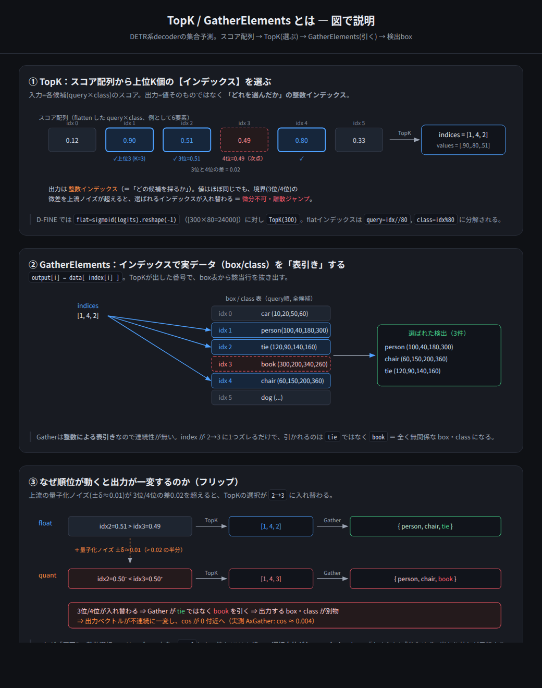
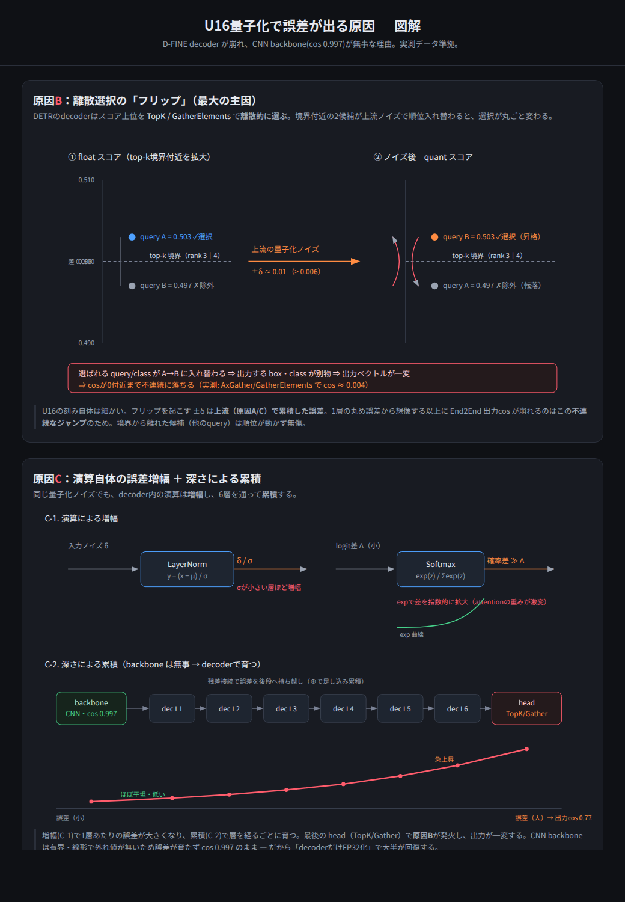
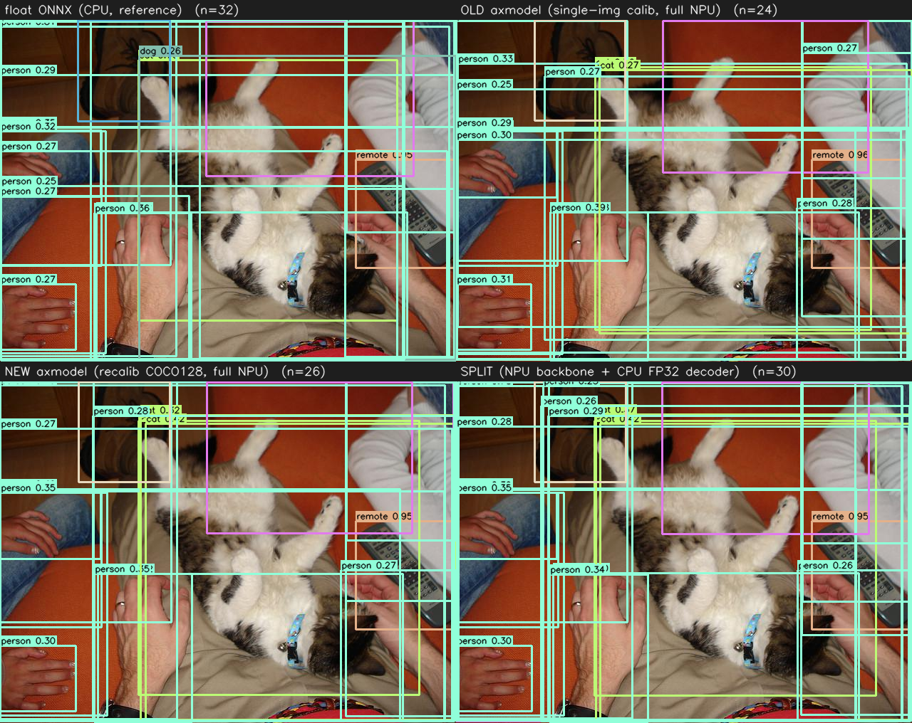

# U16量子化の精度 — 劣化の原因と対策（recalibration / モデル分割）

同梱の `.axmodel` は `pulsar2 6.0` の **U16量子化**（target AX650, NPU1）。
モデルにより劣化が異なるので、検出レベル（held-out 13枚, float ONNX を真値, IoU≥0.5 同クラス貪欲マッチ）で測定した。

## まとめ

| モデル | U16・全NPU の状態 | 対策 |
|---|---|---|
| **yolo9** | ほぼ無損失（出力cos 0.99995） | 不要。全NPUで使う |
| **rfdetr** | 検出レベルで良好（float再現 93.8%, IoU 0.977） | 不要。全NPUで使う |
| **dfine** | decoder が劣化（float再現 84%） | **分割**で 90% に回復 → [`dfine_split/`](dfine_split/) |

> `dfine`/`rfdetr` は precision_analysis の box系 cos が ~0.81 と低く見えるが、これは
> **cxcywh が密集する箱座標に対する cosine 指標の癖**による過大評価。実検出では rfdetr は IoU 0.977。
> 一方 dfine は検出レベルでも実際に劣化しており、対策が要るのは **dfine のみ**。

## なぜ dfine の decoder が劣化するのか

U16の丸め誤差は `scale = (max−min)/65535` に比例。decoder には誤差が大きく出る要素が集中する。

- **原因A: 大きなダイナミックレンジ** — attention の Mul/Softmax/LayerNorm は値の桁が開き、
  外れ値で scale が肥大 → 小さい値が潰れる。（pulsar2 も該当opを "very big range, low precision" と警告）
- **原因B: 離散選択のフリップ（最大の主因）** — DETR は `TopK`/`GatherElements` でスコア上位を
  **離散的に選ぶ**。上流の量子化ノイズが境界の僅差を超えると、選ばれる query/class が入れ替わり、
  出力が一変して cos が0付近へ（実測 AxGather cos≈0.004）。なめらかでなく**不連続なジャンプ**。
- **原因C: 増幅＋累積** — LayerNorm(÷σ) と Softmax(exp) が誤差を増幅し、decoder 3層を通って累積。

CNN backbone は有界・線形・外れ値なしで誤差が育たず **cos 0.997**。だから backbone は NPU のまま、
**decoder だけ CPU FP32** にすると劣化が大きく取れる。

## 対策と結果（dfine）

| 施策 | recall | scoreMAE | レイテンシ | 備考 |
|---|--:|--:|--:|---|
| 単一画像キャリブ・全NPU（同梱 `dfine.axmodel`） | 84.0% | 0.0407 | ~25 ms | ベースライン |
| COCO128再キャリブ・全NPU | 85.3% | 0.0261 | ~25 ms | コストゼロで scoreMAE −36% |
| **分割（backbone NPU + decoder CPU FP32）** | **90.0%** | **0.0245** | ~31 ms | [`dfine_split/`](dfine_split/) |

### カット位置の最適化（frontier）
decoder=3層。NPU に戻す層数を変えて測定 → **headだけ CPU は無駄**（スコアが上流で既に汚染＝原因Bの実証）、
精度は **CPUに載せた decoder層数に比例**。層をNPUに戻すと NPU時間が増えて合計は縮まないため、
**「decoder全体を CPU FP32」が frontier 上の最適点**。

## 指針

- **速度優先**: 全NPU（`infer_*.py`）。yolo9/rfdetr はこれで十分、dfine も再キャリブ版なら scoreMAE 改善。
- **精度優先（dfineのみ）**: [`dfine_split/`](dfine_split/) のハイブリッド（recall 90%）。
