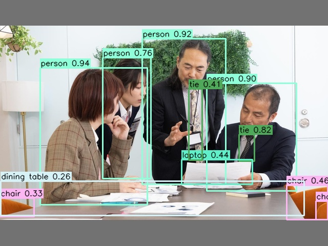
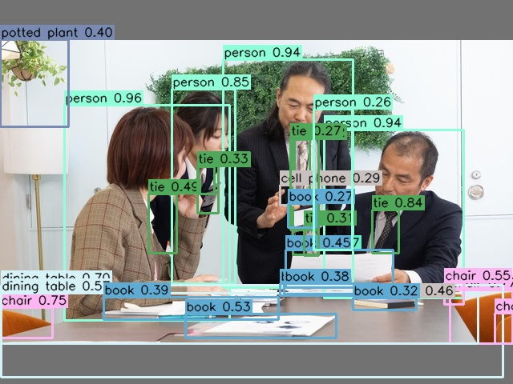
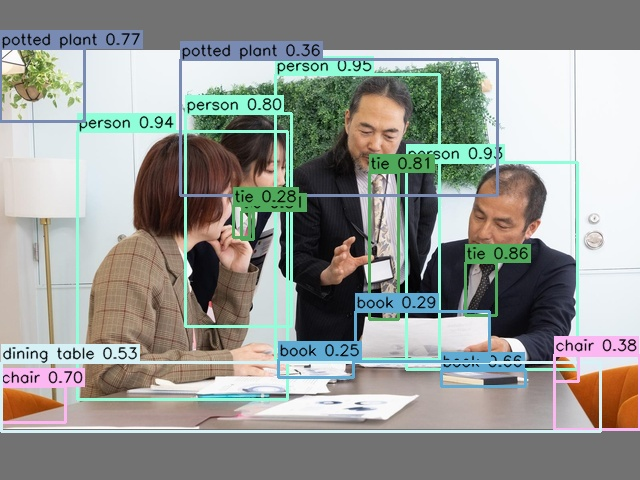

# libreyolo_llm8850

[LibreYOLO](https://github.com/LibreYOLO/libreyolo) からエクスポートした物体検出モデルを、
**AX650N NPU（M.2 アクセラレータ「LLM8850」など）** 上で
[axengine](https://github.com/AXERA-TECH/pyaxengine)（`AXCLRTExecutionProvider`）を使って推論する、
単一ファイル完結の最小スクリプト集です。

ONNX を `pulsar2 6.0` で **U16 量子化**して `.axmodel` に変換済みのモデルを同梱しており、
`axengine` + `OpenCV` + `NumPy` だけで NPU 推論が動きます。

## 同梱モデル

| スクリプト | ファミリー | モデル | 入力 | 前処理 | 後処理 |
|---|---|---|---|---|---|
| `infer_yolo9.py` | YOLOv9 | `yolo9.axmodel` | 640 | letterbox(左上詰め, pad=114) + RGB + /255 | conf → **NMS** → 逆スケール |
| `infer_dfine.py` | D-FINE | `dfine.axmodel` | 640 | 単純リサイズ + RGB + /255 | DETR 集合予測 **(NMS フリー)** |
| `infer_rfdetr.py` | RF-DETR | `rfdetr.axmodel` | 384 | 単純リサイズ + RGB + /255 + ImageNet 正規化 | DETR 集合予測 (NMS フリー / COCO91→80) |

> `.axmodel` は ONNX のメタデータ（クラス名 / `imgsz`）を持たないため、クラス名は COCO80 を
> スクリプトに内蔵し、`imgsz` は入力テンソルの shape から読み取ります。

## 動作環境

- **AX650N NPU を搭載したデバイス**（M.2 アクセラレータ「LLM8850」など）。`axengine` の
  `AXCLRTExecutionProvider` は AXCL ランタイム（`libaxcl_rt` 等）を呼ぶため、AX のボード／ホスト環境が必要です。
- Python 3.8+ / NumPy / OpenCV

## セットアップ

`axengine` ランタイム本体はこのリポジトリには含めていません。AX650N デバイス上で別途入手してください
（[pyaxengine](https://github.com/AXERA-TECH/pyaxengine) のリリース、またはデバイスの BSP に同梱のもの）。

```bash
# 推論スクリプトが import する依存(numpy / opencv-python)
pip install -r requirements.txt
# axengine は別途インストール(例)
#   pip install <pyaxengine の wheel>
```

## 使い方

引数なしで実行すると、同梱の `sample_640x480.jpg` を推論し、結果画像を
`sample_640x480_<family>_axmodel.jpg` として入力画像と同じ場所に保存します。

```bash
python infer_yolo9.py
python infer_dfine.py
python infer_rfdetr.py
```

任意の画像・しきい値を指定する場合:

```bash
python infer_yolo9.py --model yolo9.axmodel --image foo.jpg --conf 0.3 --iou 0.45
python infer_dfine.py  --model dfine.axmodel  --image foo.jpg --conf 0.4
python infer_rfdetr.py --model rfdetr.axmodel --image foo.jpg --conf 0.4
```

| オプション | 説明 | 既定 |
|---|---|---|
| `--model` | 使用する `.axmodel` | 各スクリプトの同名モデル |
| `--image` | 入力画像 | `sample_640x480.jpg` |
| `--out`   | 出力画像パス | `<入力>_<family>_axmodel.jpg` |
| `--conf`  | 信頼度しきい値 | `0.25` |
| `--iou`   | NMS の IoU しきい値（yolo9 のみ） | `0.45` |

## 推論結果（サンプル）

`sample_640x480.jpg` に対する各モデルの NPU 推論結果（`image/` に同梱）:

| YOLOv9 | D-FINE | RF-DETR |
|---|---|---|
|  |  |  |

## 量子化精度に関する注意（U16）
同梱の `.axmodel` は `pulsar2 6.0` / target=**AX650** / **U16 量子化** で変換しています。

| モデル | float再現(recall) | meanIoU | 実態 |
|---|--:|--:|---|
| yolo9 | — | — | ✅ ほぼ無損失。全NPUで使う |
| rfdetr | 93.8% | 0.977 | ✅ 検出は良好。全NPUで使う |
| dfine | 84.0% | 0.94 | ⚠️ 実際に劣化。**[`dfine_split/`](dfine_split/) の分割で recall 90% に回復** |

劣化の主因は DETR decoder の **離散選択（TopK/GatherElements）のフリップ** と LayerNorm/Softmax の誤差増幅。
backbone(CNN) は U16 でも cos 0.997 と無損失なので、**decoder だけ CPU FP32 に分割**すると大きく回復する。


## ライセンス

本リポジトリのコードは [MIT License](LICENSE)。
モデルの元 OSS は [LibreYOLO](https://github.com/LibreYOLO/libreyolo)（MIT）、
ランタイムは [axengine / pyaxengine](https://github.com/AXERA-TECH/pyaxengine)（BSD）です。
